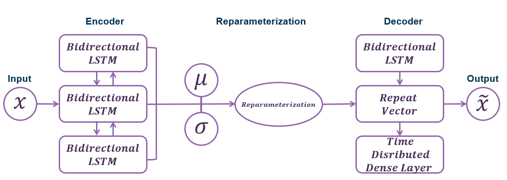
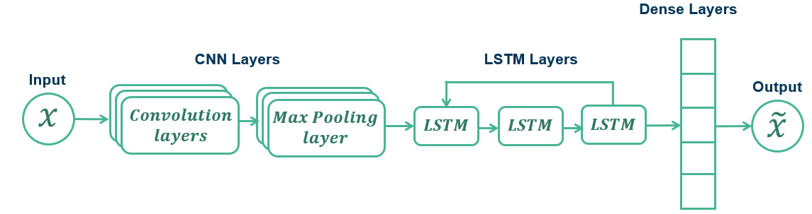
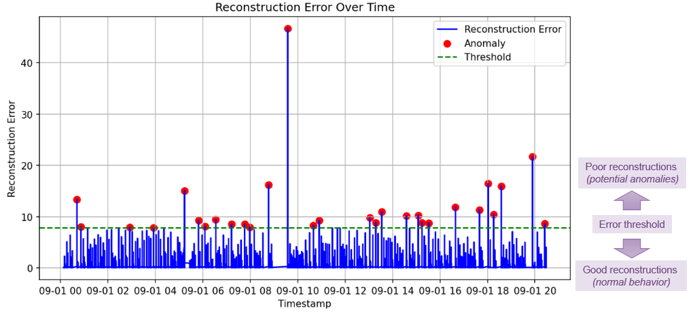
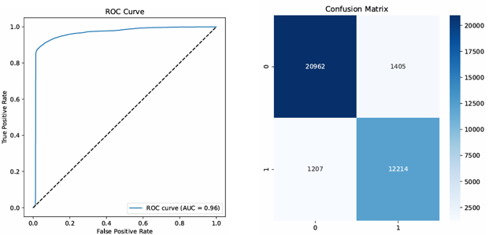
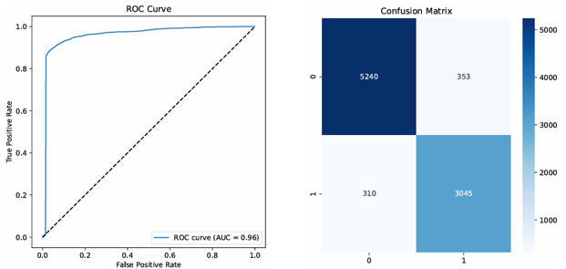

<div align="center">

 

</div>

<div align="center"> <font color=#003057>
        
# Machine Learning & Anomaly Detection at the Spallation Neutron Source Accelerator

</font>

<div> 
<font size=4 color=#828A8F><b>May 2025</b></font><br>
<font size=4><i>AJ Broderick, Arun Thakur, Ashish Verma</i></font>
</div>

</div>


## Scope
&emsp;The Spallation Neutron Source (SNS) at Oak Ridge National Laboratory is a world-leading facility for neutron scattering research, providing insights into the structure and dynamics of materials. As a complex and high-throughput scientific instrument, the ability to detect anomalies in these systems promptly and accurately is critical for ensuring experimental integrity, maintaining uptime, and protecting equipment.

&emsp; This report explores the application of machine learning (ML) techniques for anomaly detection within the SNS environment. By leveraging historical sensor data, waveform signals, and system logs, machine learning models—especially those using deep learning architectures—offer the potential to identify subtle, non-obvious deviations from normal operational patterns. These methods can supplement or even surpass traditional rule-based monitoring by learning complex patterns and adapting to system evolution over time. The scope of this investigation includes the selection of appropriate algorithms, data preprocessing strategies, model evaluation metrics, and integration considerations within the SNS control infrastructure.

## High level architecture 
### VAE-BiLSTM


### VAE-BiLSTM


# VAE-BiLSTM Model – End-to-End Explanation

##  Overview

**VAE-BiLSTM** is a hybrid deep learning architecture that combines:

- **Variational Autoencoder (VAE)** for learning compressed latent representations.
- **Bidirectional LSTM (BiLSTM)** for modeling temporal dependencies in sequential data.

This architecture is particularly suited for **unsupervised anomaly detection in time-series data**.

---

##  Architecture Breakdown

### 1. Variational Autoencoder (VAE)

####  Purpose
- Learns the underlying distribution of the input data.
- Encodes inputs into a **latent space**, allowing reconstruction of normal patterns.

####  Components
- **Encoder**: Outputs `μ` and `σ²` for a probabilistic latent representation.
- **Latent Sampling**: 
  \[
  z = \mu + \sigma \cdot \epsilon, \quad \text{where } \epsilon \sim \mathcal{N}(0, 1)
  \]
- **Decoder**: Reconstructs the input from the latent vector `z`.

####  Loss Function
\[
\mathcal{L}_{VAE} = \text{Reconstruction Loss} + \beta \cdot \text{KL Divergence}
\]
- **Reconstruction Loss**: MSE or MAE between original and reconstructed input.
- **KL Divergence**: Penalizes deviation from standard normal distribution in latent space.

---

### 2. Bidirectional LSTM (BiLSTM)

####  Purpose
- Captures temporal dependencies **in both forward and backward directions**.

####  Components
- Two LSTM layers (forward and backward).
- Concatenated output for richer context.
- Optional: dense classification layer for supervised anomaly score.

---

##  Combined VAE-BiLSTM Flow

```text
           Input Sequence
                │
        ┌───────▼────────┐
        │     Encoder     │   ← VAE
        │(Conv1D/FC → μ,σ)│
        └───────┬────────┘
                │
     Reparameterization Trick
                │
           Latent Vector z
                │
        ┌───────▼────────┐
        │     Decoder     │   ← VAE
        │  (FC or Conv1D) │
        └───────┬────────┘
                │
        Reconstructed Sequence
                │
        ┌───────▼────────┐
        │     BiLSTM     │   ← BiLSTM
        └───────┬────────┘
                │
           Output Layer
                │
          Anomaly Score / Label

``` 
## Anomaly Detection Strategy
* Train the model on normal data.
* During inference, compute:
* Reconstruction Error: High error indicates anomaly.
* Latent Distance: e.g., Mahalanobis distance in latent space.
* Sequence-based Anomaly Score from BiLSTM.

## Loss Function
loss = reconstruction_loss + beta * kl_loss + sequence_loss


## Data Analysis
&emsp; The September 2024 data from the SNS comprised multiple sources collected across different subsystems, primarily focusing on the Differential Current Monitor (DCM) and Beam Position Monitor (BPM) channels. These datasets are currently housed separately, thus preprocessing and integration pipeline was established to prepare the dataset for downstream anomaly detection modeling.

**Parsing Binary Format Data**\
&emsp; Raw data files were originally stored in a custom binary and to extract the information, a dedicated parser was implemented using Python provided by the Jefferson Lab. The parser decoded binary streams into structured arrays, each associated with timestamps, signal amplitudes, and relevant metadata such as channel IDs and acquisition parameters. 

**Merging DCM and BPM Data**\
&emsp; After successful parsing, DCM and BPM datasets were merged based on their timestamp alignment. As the data rates and acquisition intervals differed slightly between systems, time-series interpolation and resampling techniques were applied to synchronize the signals. A unified schema was defined wherein each data point represented a composite snapshot of DCM and BPM values for a given moment in time. This merge allowed the model to capture correlations between beam behavior (BPM) and system drift (DCM), enriching the feature space for more accurate anomaly detection.

**Addressing Class Imbalance with SMOTE**\
&emsp; An initial analysis of the labeled dataset revealed a significant class imbalance, with anomalous instances representing a small fraction of the total records. To mitigate this, the Synthetic Minority Over-sampling Technique (SMOTE) was applied. SMOTE synthetically generates new samples for the minority class by interpolating between existing examples. This was executed after merging and normalization to ensure data compatibility. The resulting dataset maintained a more balanced class distribution, which helped improve model generalization and reduced the bias toward the majority (normal) class during training.

This preprocessed and augmented dataset forms the foundation for subsequent model training and evaluation, enabling more robust detection of subtle and rare anomalies within the SNS operational environment.

## Current Model Architecture 

<table> <tr> 
<th>VAE-BiLSTM</th><th>CNN-LSTM</th>
</tr>
        
<tr><td><pre>
        
```    
vae-bilstm
├── data_preparation
│    ├── data_loader.py
│    ├── data_scaling.py
│    └── data_transformer.py
├── factories
│    └── sns_raw_prep_sep_dnn_factory.py
├── model
│    └── vae_bilstm.py
├── parser
│    └── configs.py
├── utils
│    └── logger.py
├── visualization
│    └── plots.py
├── driver.py
├── submit.sh
└── requirements.txt
```

</pre></td>

<td><pre>
        
```         
cnn-lstm
├── analysis
│    └── evaluation.py
├── data_preparation
│    ├── data_loader.py
│    ├── data_scaling.py
│    └── data_transformer.py
├── model
│    └── cnn_lstm_anomaly_model.py
├── parser
│    └── configs.py
├── testing
│    └── test.py
├── training
│    └── train.py
├── utils
│    └── logger.py
├── driver.py
├── submit.sh
└── requirements.txt
```

</pre></td></tr>
</table>

## Results 

### VAE-BiLSTM


### CNN-LSTM



## Pros and Cons

<table> <tr> 
<th></th><th>Pros</th><th>Cons</th>
</tr>
        
<tr>
<td>VAE-BiLSTM</td>   
<td><pre>
+ Temporal Dependencies
+ Probabilistic Latent Space
+ Sequence Variability
+ Regularized Learning
</pre></td>

<td><pre>
- Training Instability 
- Computational Complexity
- Interpretation 
- Data Requirements
</pre></td></tr>

<tr>
<td>CNN-LSTM</td>   
<td><pre>
+ Feature Extraction
+ Temporal Modeling
+ Dimensionality Reduction
+ Robust to Noise

</pre></td>

<td><pre>
- Spatial Bias
- Fixed Kernal Size
- Sequence Length 
- Architecture Tuning

</pre></td></tr>

</table>

## Future Enhancements


## JLab/ODU Capstone Recommendations

### <u>Data Access</u> 
&emsp; One of the first hurdles that the team came across was accessing the data. The Spring Semester started on January 11th and after initial meetings with the Jefferson Lab and waiting on clearance checks, we did not get access to the data until late-January/early-February. This resulted in a loss of at least three weeks to work on the project.

<font color=#4348DD>

  * The team's recommendation for future capstone projects would be to get the submission of documents and required IT trainings in Week 1. If an SOP specifically to students working with the Jefferson Lab could be developed containing the different steps and requirements needed, it could be distributed as soon as the teams are developed. This would speep up timing of getting students into the data, and give more time for data analysis and model development

</font>

### <u>iFarm & slurm</u>
&emsp; Similiar to accessing the data, one challenge that the team faced was running large scale models in the JLab environment once the models were developed in the Jupyter Notebooks. There was some trial and error that occurred when attempting to get the environment up and running in which to execute the code. Kishan did a great job in finding a solution that worked and in providing some documentation once issues were resolved 

<font color=#4348DD>
        
  * Expanding on the previous recommendation of an SOP for ODU students, there should be a JLab version that walks through the steps that would be required to create a shared folder and the required code/sub-folders for the teams to execute the code
  * Another thing that would be benefical for future ODU students would be guidelines and explinations on bits of code that we're able to change for submitting batches to slurm. We were hesitant to change too much to avoid causing downstream impacts on JLab processing cores by accidently overindexing on resources
    
</font>

## References
*Staffini, A., Svensson, T., Chung, U.-i., & Svensson, A. K. (2023). A Disentangled VAE-BiLSTM Model for Heart Rate Anomaly Detection. Bioengineering, 10(6), 683. https://doi.org/10.3390/bioengineering10060683*

*Zhao, Yun & Zhang, Xiuguo & Shang, Zijing & Cao, Zhiying. (2021). A Novel Hybrid Method for KPI Anomaly Detection Based on VAE and SVDD. Symmetry. 13. 2104. 10.3390/sym13112104.*

*Mahmoud Abdallah, Nhien An Le Khac, Hamed Jahromi, and Anca Delia Jurcut. 2021. A Hybrid CNN-LSTM Based Approach for Anomaly Detection Systems in SDNs. In Proceedings of the 16th International Conference on Availability, Reliability and Security (ARES '21). Association for Computing Machinery, New York, NY, USA, Article 34, 1–7. https://doi.org/10.1145/3465481.3469190*
